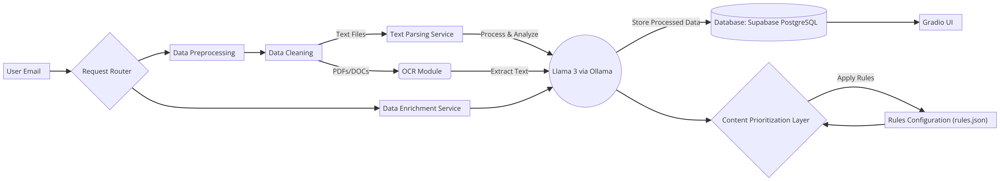

# 🚀 Gen AI-Based Email Classification and OCR

## 📌 Table of Contents
- [Introduction](#introduction)
- [Problem Statement](#problem-statement)
- [Challenge Overview](#challenge-overview)
- [Demo](#demo)
- [Inspiration](#inspiration)
- [What It Does](#what-it-does)
- [How We Built It](#how-we-built-it)
- [Challenges We Faced](#challenges-we-faced)
- [How to Run](#how-to-run)
- [Tech Stack](#tech-stack)
- [Team](#team)

---

## 🎯 Introduction
This project is a Gen AI-powered email classification and OCR application designed to automate the manual triage process in commercial banking services. It leverages Generative AI models (LLMs) such as **Llama 3** from **Ollama** for text understanding and classification. The project is built to handle large volumes of service requests arriving via email, including attachments. The solution automates the classification of emails and sub-requests, extracts relevant fields, and routes the data to appropriate channels.

## 📝 Problem Statement
Commercial bank lending service teams receive a significant volume of servicing requests through emails. These emails often contain diverse requests, including attachments, and must be processed to populate service requests that will go through workflow processing.

Manual triage requires human intervention to:
- Read and interpret the email content and attachments.
- Identify the intent and classify the "Request Type" and "Sub Request Type".
- Extract key attributes for service requests.
- Assign requests to the appropriate team or individual based on roles and skills.

The challenge is to develop an AI-powered solution to automate email classification and data extraction using Generative AI, thereby improving efficiency, accuracy, and turnaround time.

## 🗺️ Challenge Overview
The solution must:
1. **Accurately extract, interpret, and categorize emails into predefined request types and sub-request types.**
2. **Context-based data extraction:** Identify and extract essential fields like deal name, amount, and expiration date from both email bodies and attachments.
3. **Handle multi-request emails:** Ensure that complex emails with multiple requests are correctly classified.
4. **Priority-based Extraction:** Implement customizable extraction rules to prioritize emails over documents for request type identification.
5. **Duplicate Email Detection:** Identify duplicate email threads to minimize redundancy.

## 🎥 Demo
🔗 [Live Demo](#) (if applicable)  
📹 [Video Demo](#) (if applicable)  

## 💡 Inspiration
The primary motivation is to eliminate manual gatekeeping and automate the triage process for high volumes of email requests. Reducing the time and effort spent on manual classification can significantly improve operational efficiency and minimize human errors.

## ⚙️ What It Does
- **Email Classification:** Automates the classification of emails based on request and sub-request types.
- **Text Parsing:** Extracts data from PDFs, DOC files, and email bodies.
- **OCR Integration:** Recognizes text within images and PDF documents.
- **Language Model Integration:** Uses Llama 3 via Ollama for advanced text analysis and classification.
- **Gradio UI:** Provides a user-friendly web interface for running the model and reviewing results.
- **Database Integration:** Stores and retrieves parsed data efficiently.
- **Duplicate Email Detection:** Avoids redundant processing of repeated emails.
- **Priority-based Extraction:** Ensures important requests are processed first.

## 🛠️ How We Built It
- **Backend:** Python with NLTK and Ollama API for Llama 3 integration.
- **Frontend:** Gradio for interactive UI.
- **Database:** Supabase PostgreSQL.
- **Deployment:** Dockerized for consistent environment setup.
- **Model:** Llama 3 model integration via Ollama API.
- **Parsing:** Custom parsers for PDF, DOC, and email files.

## 🚧 Challenges We Faced
- Integrating the Llama 3 model with existing processing pipelines.
- Efficient handling of large and multi-attachment emails.
- Designing a scalable system to manage high email volumes.
- Implementing robust duplicate email detection mechanisms.
- Ensuring accuracy in multi-request and context-based classification.

## 🏃 How to Run
1. Clone the repository
   ```bash
   git clone https://github.com/ewfx/gaied-code-200
   ```
2. Navigate to the project directory
   ```bash
   cd gaied-code-200
   ```
3. Install dependencies
   ```bash
   pip install -r requirements.txt
   ```
4. Download and Install Ollama
   Visit the following link to download Ollama for Mac:
   [Ollama Download for Mac](https://ollama.com/download/mac)

   Once downloaded and installed, start the Llama 3.2 model using the following command:
   ```bash
   ollama run llama3.2
   ```
   ```bash
   ollama pull llama3
   ```
5. Add Database credentials(conn = psycopg2.connect("###DB Credentials###") in parsing.py)
6. Start the Gradio UI(Before starting UI make sure you change "pytesseract.pytesseract.tesseract_cmd = "#PATH TO TESSERACT###"" in parsing.py)
   ```bash
   python3 code/src/app.py
   ```


   
## 🏗️ Response Structure
   ```bash
{
  "primary_classification": {
    "request_type": "closing_notice",
    "sub_request_type": "amendment_fees",
    "confidence": "0.92",
    "matched_attributes": [
      "Loan closure (+3)",
      "Closing (+3)"
    ],
    "extracted_sentences": [
      "Effective 04-Feb-2025, the Lender Shares of facility TERM LOAN A-2 have been adjusted"
    ]
  },
  "other_classifications": [
    {
      "request_type": "closing_notice",
      "sub_request_type": "reallocation_fees",
      "confidence": "0.81",
      "matched_attributes": [
        "Loan closure (+3)",
        "Closing (+3)"
      ],
      "extracted_sentences": [
        "For: ABC BANK, NA"
      ]
    }
  ]
}
   ```
## 🏗️ Architecture Diagram

The following diagram illustrates the overall architecture of the system, showcasing the flow of data from input to output, including model integration and UI components:



## 🏗️ Tech Stack
- 🔹 **Frontend:** Gradio
- 🔹 **Backend:** Python with NLTK and Ollama API
- 🔹 **Database:** Supabase PostgreSQL
- 🔹 **Model:** Llama 3 via Ollama API
- 🔹 **Tools and Libraries:** LangChain, Pandas, Scikit-learn, PDF parsing libraries

## 👥 Team
- **Fahadh** - [GitHub](https://github.com/Fahadh4444) | [Linkedin](https://www.linkedin.com/in/fahadh-kasala-453933296/)
- **Thirumagal Dhivya** - [GitHub](https://github.com/dhivya6613) | [Linkedin](https://www.linkedin.com/in/thirumagaldhivya/)
- **DuraiRaj** - [GitHub]() | [Linkedin]()
- **Karthikeyan** - [GitHub]() | [Linkedin]()

